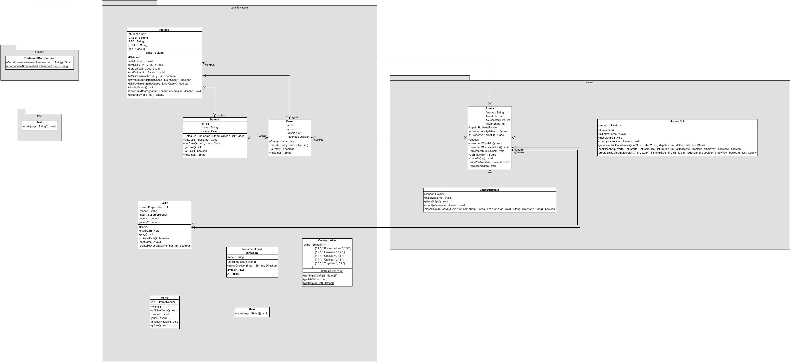

# Bataille Navale

@author Mélissa KUBRYK 

## Description
Ce projet implémente un jeu de bataille navale.

## Arborescence du projet
```
├── makefile
└── src
    ├── batailleNavale
    │   ├── Bateau.java
    │   ├── Case.java
    │   ├── Configuration.java
    │   ├── Direction.java
    │   ├── Main.java
    │   ├── Menu.java
    │   ├── Partie.java
    │   └── Plateau.java
    ├── joueur
    │   ├── Joueur.java
    │   ├── JoueurBot.java
    │   └── JoueurHumain.java
    ├── support
    │   └── TraitementCoordonnee.java
    └── test
        └── Test.java
```
## Diagramme de classe 


---

## Lancement du jeu
Pour lancer le jeu, exécutez la classe `Main.java` située dans le répertoire `src/batailleNavale` avec la commande : 
```bash
cd batailleNavale
make run
```

## Lancement des tests de l'applicatif
Pour lancer le mode de test, exécutez la classe `Test.java` située dans le répertoire `src/Test` avec la commande : 
```bash
cd batailleNavale
make test
```
J'ai tenté de faire un `make testFile` avec un fichier contenant les input à lire pour éviter aux utilisateurs de tester en entrant soi-même les données, mais ça n'a pas abouti.

## Compilation
Utilisez le `makefile` pour compiler le projet.
Pour plus d'information sur le makefile tapez sur votre terminal `make help`

## Explication 
J'ai réalisé l'intégralité des parties obligatoires du TP, cependant j'ai accumulé du retard à cause des transports lors des deux premières séances. Pour combler mon retard j'ai repris le projet chez moi et j'ai apporté mon pc portable durant les séances pour continuer confortablement, mais j'ai eu des problèmes de configuration ce qui a fait que pour les tests au début je ne testais pas correctement et je ne m'en rendais pas compte. J'ai résolu l'ensemble de ces problèmes et j'ai terminé le projet sans emcomble.


## Lien vers le git 
> https://github.com/mkubryk/BattleShip.git

## Ressources

- [Documentation sur les couleurs dans les print Java](https://www.tutorialspoint.com/how-to-print-colored-text-in-java-console)
- [Recherche sur comment faire un makefile en java avec des packages](https://stackoverflow.com/questions/6623161/javac-option-to-compile-all-java-files-under-a-given-directory-recursively)